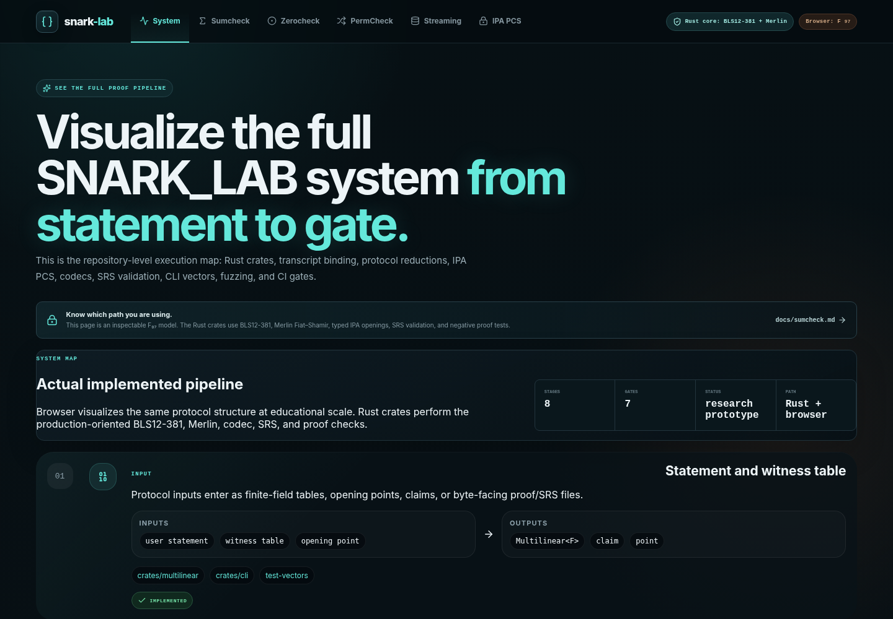
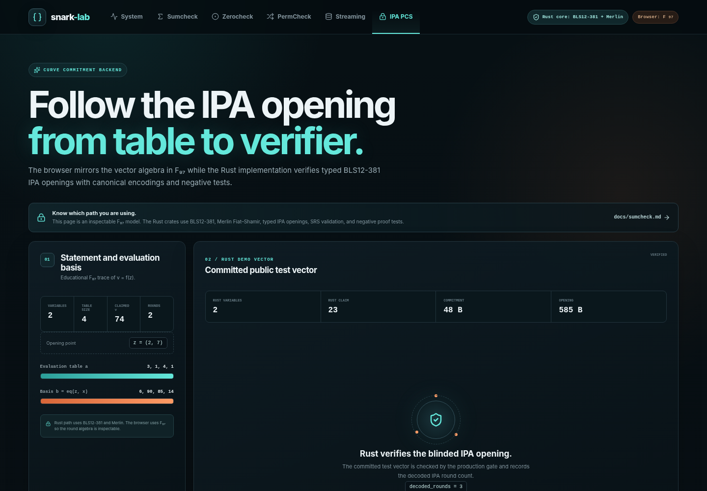
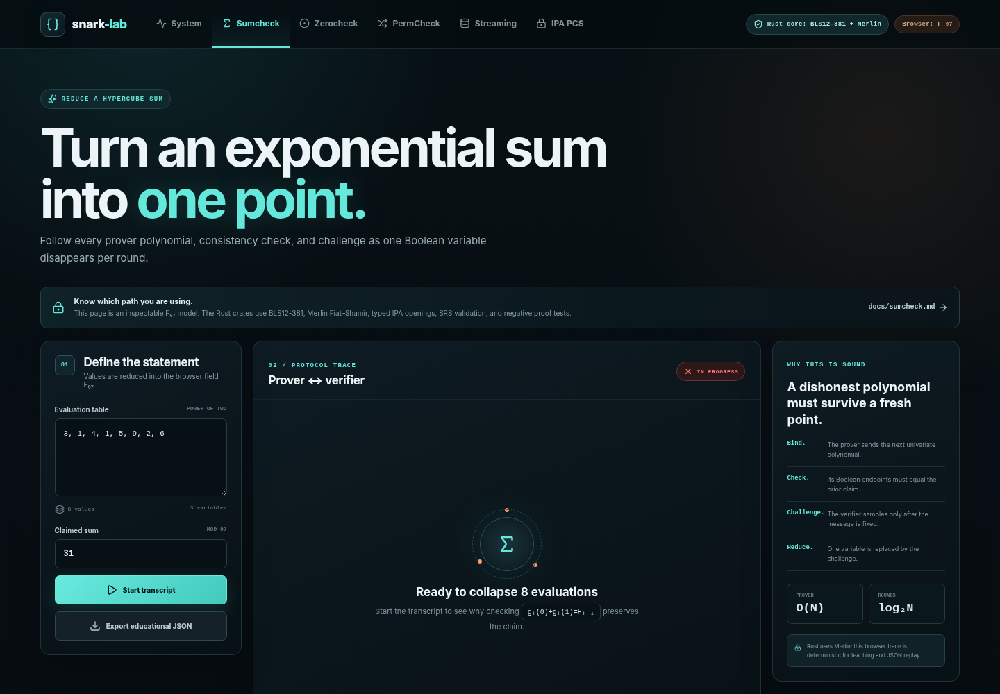

<!-- SNARK_LAB_STAR_POLISH_V1 -->

# SNARK_LAB

<!-- SNARK_LAB_BADGES_V1 -->

<p align="center">
  
  
  
  
  
  
</p>

<p align="center">
  <strong>Research prototype.</strong>
  Not audited production-secure software.
</p>

**A Rust protocol lab for SNARK building blocks: Sumcheck, Zerocheck, PermCheck, and IPA polynomial commitments.**

SNARK_LAB connects the math of interactive proofs to executable Rust code, public test vectors, fuzzing, release evidence, and an educational visualizer.

It is built for people who want to understand how SNARK protocols actually fit together, not just read theorem statements.

## Why this repository matters

Most SNARK learning material stops at equations. Most production libraries hide the protocol mechanics behind APIs.

SNARK_LAB sits in the middle:

- readable protocol implementations
- transcript-bound proof flows
- IPA commitment/opening path
- malformed-proof rejection tests
- fuzz targets and fuzz regression tracking
- public vectors and reference comparisons
- release-candidate evidence
- browser visualizer for protocol flow

## Current status

| Area | Status |
|---|---|
| Sumcheck | Implemented and tested |
| Zerocheck | Implemented and tested |
| PermCheck | Implemented and tested |
| IPA PCS path | Implemented as a research prototype |
| IPA proof codecs | Fuzzed and regression-tested |
| SRS loader/provenance | Implemented with production-boundary checks |
| Visualizer | Implemented |
| Release candidate | v0.2.0-rc.1 |
| Production-secure deployment | Not claimed |
| External audit | Not yet completed |

## What this is

SNARK_LAB is:

- a serious research/engineering prototype
- a protocol-learning laboratory
- a reproducible SNARK component testbed
- a release-candidate artifact with evidence gates

## What this is not

SNARK_LAB is not yet:

- audited deployment-ready cryptographic software
- mainnet-ready cryptographic infrastructure
- custody-safe software
- a replacement for external review
- a production SRS ceremony

Do not use this repository for production funds, custody, consensus-critical systems, or security-critical deployment.

## Quickstart

Run the full production-readiness gate:

    scripts/check-production-ready.sh

Run Rust tests:

    cargo test --workspace

Run the visualizer:

    cd web/visualizer
    npm ci
    npm run dev

Build release artifacts for the current release candidate:

    scripts/build-github-release-artifacts.sh v0.2.0-rc.1

## Protocol map

| Protocol | Purpose |
|---|---|
| Sumcheck | Proves claims about sums over Boolean hypercubes |
| Zerocheck | Reduces constraint satisfaction to polynomial zero checks |
| PermCheck | Checks multiset/permutation consistency |
| IPA PCS | Commits to multilinear polynomials and proves openings |
| SRS tooling | Validates public parameter provenance and artifact boundaries |


## Visualizer screenshots

The visualizer shows how the protocol components fit together.

<p align="center">
  
  
</p>

<p align="center">
  
</p>

## Evidence and hardening

| Evidence layer | Location |
|---|---|
| Production gate | `scripts/check-production-ready.sh` |
| Release candidate evidence | `release-candidates/LATEST.md` |
| Public vectors | `test-vectors/` |
| Fuzz targets | `fuzz/fuzz_targets/` |
| Fuzz smoke evidence | `fuzz/smoke-evidence/` |
| Fuzz crash regressions | `fuzz/regressions/` |
| SRS policy | `srs/PRODUCTION_SRS_POLICY.md` |
| Deployment guide | `docs/production-deployment-guide.md` |
| Audit packet | `audits/packet/README.md` |

## Suggested reading order

1. `README.md`
2. `docs/production-readiness-index.md`
3. `docs/security-review-checklist.md`
4. `docs/ipa-proof-decoder-fuzz-regression.md`
5. `release/v0.2.0-rc.1.md`
6. `web/visualizer/`

## Release candidate

Current release candidate:

    v0.2.0-rc.1

The release candidate is suitable for review, reproducibility checks, and protocol study. It is not production-secure.

---


## Existing detailed documentation

# SNARK_LAB

**Build, inspect, test, and benchmark SNARK protocol components.**

`SNARK_LAB` is a Rust + TypeScript research lab for understanding and engineering SNARK building blocks: Sumcheck, Zerocheck, PermCheck, streaming bottlenecks, transcript binding, and an experimental Inner Product Argument (IPA) polynomial-commitment path.

The Rust core is built with Arkworks primitives, BLS12-381 scalar-field support, Merlin Fiat–Shamir transcripts, checked serialization boundaries, local production gates, and a browser visualizer for interactive protocol inspection.

> **Security boundary:** this repository is serious protocol infrastructure and a production-grade research prototype, but it is **not audited** and must **not** be used to protect funds, production systems, or security-critical deployments. The code intentionally labels educational components, rejects fake success paths, and keeps unsupported cryptographic configurations explicit.

---

## Status

| Component                                          | Status        |
| -------------------------------------------------- | ------------- |
| Fiat–Shamir Sumcheck                               | Implemented   |
| Zerocheck reduction                                | Implemented   |
| PermCheck product/rational fingerprints            | Implemented   |
| Transparent multilinear oracle                     | Implemented   |
| Browser-to-Rust educational transcript interchange | Implemented   |
| IPA commitment equation                            | Implemented   |
| IPA reduction-round state                          | Implemented   |
| IPA vector and generator folding                   | Implemented   |
| IPA L/R curve commitments                          | Implemented   |
| IPA prover opening loop                            | Implemented   |
| IPA verifier reduction loop                        | Implemented   |
| IPA proof codec                                    | Implemented   |
| Blinded IPA opening path                           | Implemented   |
| Integrated IPA commit/open/verify API              | Implemented   |
| IPA CLI demo                                       | Implemented   |
| IPA SRS provenance validation                      | Implemented   |
| IPA SRS file loader                                | Implemented   |
| IPA SRS validation CLI                             | Implemented   |
| Negative malformed-proof fixtures                  | Implemented   |
| Randomized IPA roundtrip tests                     | Implemented   |
| CLI SRS tooling integration tests                  | Implemented   |
| Fuzzing                                            | Implemented   |
| Benchmark suite for IPA path                       | Implemented   |
| Security proof sketch / threat model               | Planned       |
| External audit                                     | Not performed |

---

## Quick Start

### Run the full production gate

```bash
scripts/check-production-ready.sh
```

This gate runs:

```text
cargo fmt
cargo clippy with warnings denied
cargo test
visualizer production build
unsafe Rust rejection
visualizer NaN-footgun rejection
git working-tree summary
```

### Run all Rust tests

```bash
cargo test --workspace
```

### Run the IPA commit/open/verify demo

```bash
cargo run -p snark-lab-cli -- ipa-demo
```

Expected output includes:

```text
ipa-demo: verified blinded IPA opening
variables=2
commitment_bytes=48
decoded_rounds=3
```

### Validate an IPA SRS file

```bash
cargo run -p snark-lab-cli -- ipa-srs-validate --curve bls12-381-g1 ./path/to/ipa.srs
```

This command loads an SRS file, decodes canonical curve points, checks provenance, verifies the canonical SHA-256 basis digest, and rejects malformed or non-production SRS material.

### Run the browser visualizer

```bash
cd web/visualizer
npm install
npm run dev
```

Open:

```text
http://localhost:5173
```

The browser lab uses small educational arithmetic where appropriate so protocol state remains inspectable. The Rust core uses Arkworks field and curve types.

---

## What Is Implemented?

| Protocol Component     | Rust Core                                                                                                                             | Browser Lab                               |
| ---------------------- | ------------------------------------------------------------------------------------------------------------------------------------- | ----------------------------------------- |
| Sumcheck               | Generic multilinear Sumcheck with transcript-bound round polynomials and Merlin challenges                                            | Step-by-step educational visualization    |
| Zerocheck              | Constraint table bound before equality-mixing challenge; delegates to Fiat–Shamir Sumcheck                                            | Toggle violated constraints               |
| PermCheck              | Transcript-bound β, γ, tagged product/rational fingerprints, explicit denominator-pole errors                                         | Compare product and rational fingerprints |
| Scribe-style pressure  | Large-field runtime benchmark plus explicit logical I/O model                                                                         | Product-tree vs. streaming traffic        |
| Transcript interchange | Educational JSON verifier isolated in `crates/interchange`                                                                            | Export current Sumcheck experiment        |
| IPA PCS                | Typed IPA commitment/opening path with checked curve commitments, proof codec, blinding extension, SRS provenance, and CLI validation | IPA PCS panel                             |

---

## Repository Layout

```text
snark-lab/
├── crates/
│   ├── field/          # default BLS12-381 scalar field helpers
│   ├── multilinear/    # dense multilinear extensions and equality basis
│   ├── transcript/     # Merlin Fiat–Shamir abstraction
│   ├── sumcheck/       # generic transcript-bound Sumcheck
│   ├── zerocheck/      # transcript-ordered equality reduction
│   ├── permcheck/      # product/rational permutation fingerprints
│   ├── oracle/         # transparent oracle + IPA PCS infrastructure
│   ├── interchange/    # educational browser JSON verifier
│   ├── cli/            # transcript verifier, IPA demo, SRS validator
│   └── benches/        # runtime and logical I/O benchmarks
├── web/visualizer/     # React + TypeScript protocol workbench
├── examples/transcripts/
├── notebooks/
├── docs/
├── scripts/
└── .github/workflows/
```

---

## CLI Commands

### Verify an educational browser transcript

```bash
cargo run -p snark-lab-cli -- verify-transcript examples/transcripts/sumcheck-valid.json
cargo run -p snark-lab-cli -- verify-transcript examples/transcripts/sumcheck-bad-round.json
```

The version-1 interchange format is deterministic for visualizer compatibility and is explicitly educational. It does not drive the Rust cryptographic protocol challenges.

### Run a real IPA backend demo

```bash
cargo run -p snark-lab-cli -- ipa-demo
```

This executes:

```text
commit
open
encode public opening
decode public opening
verify
```

### Validate an IPA SRS file

```bash
cargo run -p snark-lab-cli -- ipa-srs-validate [--curve bls12-381-g1] <path.srs>
```

Validation checks:

```text
file read
format magic
canonical SRS decode
curve-point decode
identity rejection
duplicate rejection
generator-count validation
provenance validation
canonical basis digest validation
```

Unsupported curves fail before file access.

---

## IPA PCS Path

The IPA path currently includes:

```text
typed curve-point wrapper
canonical compressed point serialization
curve generator basis validation
commitment equation
prover commitment path
evaluation-basis construction
opening statement binding
reduction-round state
L/R round commitment computation
vector folding
generator folding
prover opening loop
verifier reduction loop
final commitment relation check
proof shape validation
proof codec
blinded opening extension
integrated commit/open/verify API
SRS provenance validation
SRS file loader
SRS validation CLI
negative fixtures
randomized roundtrip tests
CLI tooling tests
```

The typed integrated IPA backend is the supported path. Older shape-only backend surfaces remain explicit and must not fake successful proving or verification without the required curve, SRS, and blinding material.

---

## SRS Provenance Model

Production SRS material must have provenance.

Accepted source types:

```text
ExternalTrustedSetup
HashToCurveDerivation
```

Rejected source type:

```text
KnownDiscreteLogTestFixture
```

The canonical SRS digest binds:

```text
digest domain version
variable count
polynomial generators
evaluation generators
blinding generator
```

The loader returns only `IpaVerifiedSrs`, meaning decoded material has already passed validation.

The repository does **not** claim that test fixture generators are production SRS material.

---

## Fiat–Shamir Ordering

Challenges are derived only after the relevant statement and prior prover message have been transcript-bound.

```text
bind protocol domain + public statement + oracle commitment
                              │
                              ▼
                     append prover message
                              │
                              ▼
                    derive challenge
                              │
                              ▼
                     append next message
                              │
                              ▼
                    derive next challenge
```

For Zerocheck, the constraint oracle is bound before the mixing point is derived.

For PermCheck, tagged columns are bound before β and γ are derived.

For IPA, opening statements and reduction-round commitments are absorbed before each folding challenge.

---

## Design Principles

1. **Messages before challenges.** Fiat–Shamir challenges are derived only after binding the relevant prior data.
2. **No fake success paths.** Unsupported cryptographic paths must return explicit errors.
3. **Checked curve material.** IPA curve points reject identity points and use canonical compressed serialization.
4. **SRS provenance is mandatory.** Production SRS material must be externally supplied or derived with auditable provenance.
5. **Educational components stay labeled.** Browser and interchange examples are not confused with the Rust cryptographic path.
6. **Fail closed on malformed inputs.** Decoders, proof checks, and CLI validators reject corrupt data.
7. **No unsafe Rust.** The production gate rejects unsafe Rust.
8. **Measured vs. modeled.** Runtime measurements and logical I/O models are kept distinct.

---

## Browser Visualizer

The browser workbench includes visual panels for:

```text
Sumcheck
Zerocheck
PermCheck
Scribe-style streaming pressure
IPA PCS
educational transcript export
```

Browser arithmetic is educational where small fields improve readability. The Rust protocol core is separate.

---

## Documentation

Key documentation lives in `docs/`, including:

```text
Fiat–Shamir Sumcheck
Zerocheck reduction
PermCheck fingerprints
Scribe streaming bottleneck
transparent oracle abstraction
IPA transcript rounds
IPA proof shape
IPA proof serialization
IPA generator basis
IPA curve types
IPA commitment equation
IPA prover commit path
IPA opening statement
IPA reduction rounds
IPA round commitments
IPA generator folding
IPA prover opening loop
IPA verifier opening loop
IPA blinding extension
IPA blinded prover/verifier path
IPA backend integration
IPA proof codec integration
IPA negative proof fixtures
IPA randomized roundtrip tests
IPA SRS provenance
IPA SRS loader
IPA SRS CLI
IPA SRS tooling tests
CI matrix and audit
local production gates
```

---

## Testing and Hardening

Current checks include:

```text
unit tests
negative malformed-proof tests
randomized roundtrip tests
CLI integration tests
canonical codec tests
production gate script
GitHub production-readiness workflow
Linux + macOS CI matrix
RustSec cargo-audit workflow
npm high-severity audit
Dependabot for Cargo, npm, and GitHub Actions
unsafe Rust rejection
visualizer production build
```

Planned hardening:

```text
fuzzing for proof and SRS decoders
larger IPA benchmark suite
memory profiling
dependency audit
CI matrix across Linux/macOS and stable Rust
threat model document
security theorem / proof sketch
side-channel review
external audit
```

---

## Benchmarks

Run the existing benchmark driver:

```bash
cargo run --release -p snark-lab-benches -- 18 8 3
```

The optional argument is `log₂(N)`, capped by the benchmark harness.

Current benchmark outputs distinguish measured runtime from modeled logical I/O. The benchmark binary includes PermCheck, Sumcheck, and IPA commit/open/verify timing. Future work will add memory profiles and hardware-counter-backed reports.

---

## Security Policy

See:

```text
SECURITY.md
```

This repository is not audited. Do not use it for production funds, mainnet systems, custody, consensus-critical infrastructure, or security-critical deployments.

---

## Roadmap

### Near-Term

```text
refresh README and public-facing docs
add SRS CLI tooling tests
add fuzzing targets for proof/SRS decoders
add IPA benchmark suite
add threat model and security proof sketch
update browser IPA panel to show real opening flow
```

### Research Direction

```text
compose Zerocheck + PermCheck + Sumcheck into a small HyperPlonk/Scribe-style proving pipeline
evaluate streaming and memory pressure in commitment-backed protocols
compare product-tree and rational PermCheck variants
measure prover I/O and memory bottlenecks
study Scribe-style polynomial commitment integration choices
```

---

## License

MIT

## Security boundary documents

See:

    docs/threat-model-and-security-notes.md
    docs/security-review-checklist.md

## Security proof sketch

See:

    docs/security-proof-sketch.md

This is a proof-outline for the implemented research prototype. It is not an audit and not a production deployment claim.

## Release and versioning

See:

    RELEASE.md
    VERSIONING.md
    CHANGELOG.md

Current releases are research-preview releases. They are not audited and are not production-secure deployment software.

## Public test vectors

See:

    test-vectors/README.md
    docs/public-test-vectors.md

The committed vectors are regression artifacts for the research prototype. They are not production SRS material.

## Reference implementation comparison

See:

    docs/reference-implementation-comparison.md

The reference tests compare selected production algebra against an independent slow implementation.

## Dependency update policy

See:

    docs/dependency-update-policy.md

Cryptographic dependencies are reviewed manually. Arkworks minor/major updates are intentionally not merged one crate at a time.

## Fuzzing

See:

    FUZZING.md
    docs/long-fuzz-campaign-notes.md

The production gate compile-checks fuzz targets. Long-running fuzz campaign artifacts are required before stronger production-security claims.

## Visualizer IPA flow

See:

    docs/visualizer-real-ipa-flow.md

The browser IPA tab now shows the real IPA opening flow at educational scale while preserving the Rust/BLS12-381 security boundary.

## Visualizer demo

See:

    web/visualizer/README.md
    docs/visualizer-polish-and-demo.md

The IPA tab is the recommended GitHub Pages demo entry point.

## System flow visualizer

See:

    docs/visualizer-system-flow.md

The System tab shows the actual repository pipeline from statement input to protocol reductions, IPA PCS, codecs, SRS validation, CLI vectors, fuzzing, and CI gates.

## Side-channel and deployment evidence

See:

    docs/side-channel-boundary-notes.md
    docs/production-deployment-evidence.md

The target is a production system, but production-secure claims require audit evidence, side-channel review, and production SRS ceremony evidence.

## Production SRS ceremony specification

See:

    docs/production-srs-ceremony-spec.md
    ceremony/README.md

The repository now defines a production SRS/public-parameter ceremony manifest format and verifier. A real production ceremony still requires real artifacts, digests, transcript evidence, and audit status.

## Deployment evidence pack

See:

    docs/deployment-evidence-pack.md
    deployment/README.md

The repository can generate deployment evidence packs containing commit hashes, toolchain versions, gate outputs, public vector checks, SRS manifest checks, and artifact digests.

## Audit readiness packet

See:

    docs/audit-readiness-packet.md
    audits/packet/README.md

The repository now includes audit scope, finding templates, remediation tracking, triage policy, and audit status structure.

## Release-candidate evidence

See:

    docs/release-candidate-evidence-run.md
    release-candidates/README.md

The repository can summarize generated deployment evidence packs into small release-candidate evidence records.

## Production release checklist and tagging

See:

    docs/production-release-checklist-and-tagging.md
    release/PRODUCTION_RELEASE_CHECKLIST.md

The repository now includes release-checklist validation and safe annotated tag preparation for release candidates.

## Release candidate

Current release-candidate notes:

    release/v0.2.0-rc.1.md

The release candidate is for protocol review, artifact review, and audit preparation. It is not production-secure.

## GitHub release artifacts and checksums

See:

    docs/github-release-artifacts-and-checksums.md

Release artifacts can be generated with:

    scripts/build-github-release-artifacts.sh v0.2.0-rc.1

## Long fuzz campaign evidence

See:

    docs/long-fuzz-campaign-evidence.md

The repository includes tooling to run and archive long fuzz campaign evidence for IPA proof/opening/SRS byte parsers.

## Production readiness index

See:

    docs/production-readiness-index.md
    docs/production-deployment-guide.md
    docs/operator-runbook.md

The repository now has a release-candidate deployment guide and operator runbook. It is not yet production-secure.

## Production SRS placeholder policy

See:

    docs/production-srs-artifact-placeholder-policy.md
    srs/PRODUCTION_SRS_POLICY.md

The repository rejects fake or placeholder production SRS artifacts. Production SRS material must be published with digest, manifest, transcript, and verifier evidence.

## Fuzz campaign runner

See:

    docs/fuzz-nightly-runner-fix.md

Fuzz targets compile on stable, while actual cargo-fuzz campaigns require a nightly Rust toolchain.

## Fuzz campaign runner hardening

See:

    docs/fuzz-campaign-runner-hardening.md

Failed fuzz runs are not treated as evidence. Generated fuzz corpora and artifacts are ignored by default.

## IPA fuzz runtime requirements

See:

    docs/ipa-fuzz-target-runtime-fix.md

Stable CI compiles fuzz targets. Actual cargo-fuzz execution requires nightly Rust and rust-src.

## IPA proof decoder fuzz regression

See:

    docs/ipa-proof-decoder-fuzz-regression.md

A fuzz-discovered capacity-overflow panic in the IPA proof decoder is covered by a regression test.

## Nightly fuzz smoke evidence

See:

    docs/nightly-fuzz-smoke-evidence.md
    fuzz/smoke-evidence/v0.2.0-rc.1/manifest.json

The repository records successful nightly smoke fuzz evidence for the IPA proof decoder. This is not long-campaign or production-security evidence.

## All fuzz targets smoke evidence

See:

    docs/all-fuzz-targets-smoke-evidence.md
    fuzz/smoke-evidence/v0.2.0-rc.1/all-targets/manifest.json

All fuzz targets have short nightly smoke evidence. This is not long-campaign or production-security evidence.

## Fuzz crash regression suite

See:

    docs/fuzz-crash-regression-suite.md
    fuzz/regressions/README.md

Fuzz-discovered crashes are converted into stable regression tests.

## GitHub Release page

See:

    release/GITHUB_RELEASE_PAGE_v0.2.0-rc.1.md
    scripts/print-github-release-command.sh

The release page records assets, checksums, evidence locations, and the non-production security boundary.

## GitHub Release publication evidence

See:

    release/publication/v0.2.0-rc.1/README.md

The repository records evidence that the v0.2.0-rc.1 GitHub Release page was published with expected assets.

## Current release candidate

The current main-branch release candidate is:

    v0.2.0-rc.2

See:

    release/v0.2.0-rc.2.md
    release/GITHUB_RELEASE_PAGE_v0.2.0-rc.2.md
