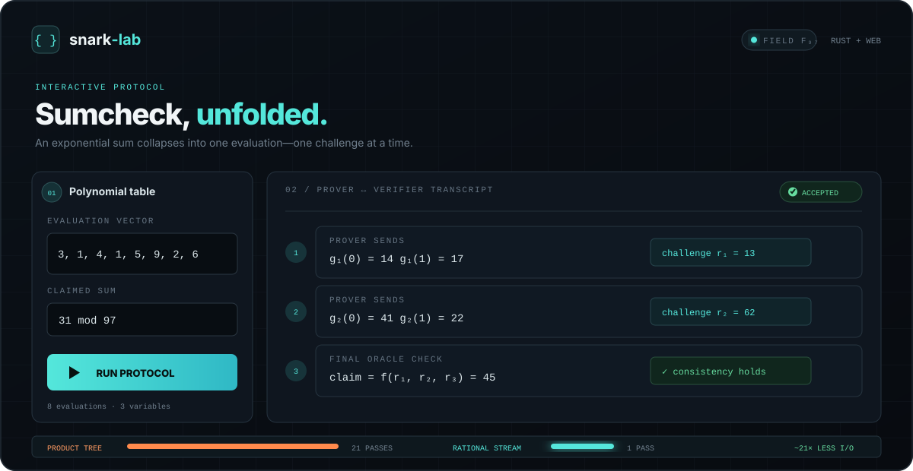

<p align="center">
  
</p>

# snark-lab: Build, inspect, and benchmark SNARK protocols

**Arkworks-based Rust implementations of Fiat–Shamir Sumcheck, Zerocheck, and permutation fingerprints, paired with TypeScript visualizations of their algebra and streaming costs.**

The Rust protocol core is generic over `ark_ff::PrimeField`, uses the BLS12-381 scalar field by default, and derives challenges from a domain-separated Merlin transcript only after binding the preceding statement or prover message. The browser labs intentionally retain F₉₇ so every value remains readable.

> **Security boundary:** this is serious protocol infrastructure, but not yet a complete production SNARK. The current oracle interface is transparent: prover and verifier bind the full evaluation table into the Fiat–Shamir transcript and the verifier evaluates it directly. A polynomial-commitment backend, succinct openings, hardened serialization review, and external audit are still required before production use.

## What is implemented?

| Protocol component | Rust core | Browser lab |
|---|---|---|
| Sumcheck | Generic multilinear Sumcheck with transcript-bound round polynomials and Merlin challenges | Step-by-step F₉₇ visualization |
| Zerocheck | Constraint table is bound before the equality-mixing point is sampled; reduction delegates to Fiat–Shamir Sumcheck | Toggle a violated constraint |
| PermCheck | Transcript-bound `β, γ`, tagged product/rational fingerprints, explicit denominator-pole errors | Compare product and rational fingerprints |
| Scribe-style pressure | Large-field runtime benchmark plus explicit logical I/O model | Scale product-tree vs. streaming traffic |
| Transcript interchange | Educational F₉₇ JSON verifier isolated in `crates/interchange` | Export current Sumcheck experiment |

## Run the Rust protocol core

```bash
cargo test --workspace
cargo run --release -p snark-lab-benches -- 20
```

The benchmark uses `ark_bls12_381::Fr`. The optional argument is `log₂(N)` (capped at 24). Runtime is measured; I/O bytes are an explicit model rather than hardware counters.

## Launch the browser lab

```bash
cd web/visualizer
npm install
npm run dev
```

Open `http://localhost:5173`. Browser arithmetic is educational F₉₇ and is not the Rust cryptographic path.

## Verify an educational browser export

```bash
cargo run -p snark-lab-cli -- verify-transcript examples/transcripts/sumcheck-valid.json
cargo run -p snark-lab-cli -- verify-transcript examples/transcripts/sumcheck-bad-round.json
```

The version-1 interchange format remains deterministic for visualizer compatibility and is explicitly namespaced as educational. It does not drive Rust protocol challenges. See the [interchange schema](docs/transcript-schema.md).

## Fiat–Shamir ordering

```text
bind protocol domain + public statement + transparent oracle
                              │
                              ▼
                     append round g₁
                              │
                              ▼
                    derive r₁ with Merlin
                              │
                              ▼
                     append round g₂
                              │
                              ▼
                    derive r₂ with Merlin
```

For Zerocheck, the constraint oracle is bound before the mixing point `τ` is derived. For PermCheck, both tagged columns are bound before `β` and `γ` are derived. The same statement and messages reproduce the same challenges, while any changed statement or earlier message changes subsequent challenges.

## Architecture

```text
snark-lab/
├── crates/
│   ├── field/          # default BLS12-381 scalar field
│   ├── multilinear/    # generic dense MLEs and eq polynomial
│   ├── transcript/     # Merlin Fiat–Shamir abstraction
│   ├── sumcheck/       # generic transcript-bound Sumcheck
│   ├── zerocheck/      # transcript-ordered equality reduction
│   ├── permcheck/      # transcript-bound product/rational checks
│   ├── interchange/    # educational F_97 browser JSON only
│   ├── cli/            # educational export verifier
│   └── benches/        # large-field runtime + logical I/O model
├── web/visualizer/     # educational React + TypeScript workbench
├── examples/transcripts/
├── notebooks/
└── docs/
```

## Design principles

- **Messages before challenges.** Every challenge is derived only after the relevant statement and prior prover message have been transcript-bound.
- **Large-field generic core.** Protocol crates use Arkworks field traits; BLS12-381 `Fr` is the default concrete field.
- **Explicit oracle boundary.** Transparent tables work today; commitment-backed openings are the next abstraction, not something the project pretends already exists.
- **Educational code stays labeled.** F₉₇ exists only in the browser and interchange fixtures.
- **Measured vs. modeled.** Benchmarks distinguish measured runtime from logical memory/I/O estimates.

## Documentation

- [Fiat–Shamir Sumcheck](docs/sumcheck.md)
- [Zerocheck as transcript-ordered weighted Sumcheck](docs/zerocheck.md)
- [Transcript-bound product and rational PermCheck](docs/permcheck.md)
- [The Scribe streaming bottleneck](docs/scribe-bottleneck.md)
- [Educational transcript interchange schema](docs/transcript-schema.md)
- [Worked examples notebook](notebooks/protocol-examples.md)

## Roadmap

1. Add a transcript-bound oracle trait separating table binding from final evaluation openings.
2. Add a polynomial-commitment backend (KZG, IPA, or another explicitly selected construction).
3. Replace direct verifier table evaluation with commitment openings and batch verification.
4. Add extension-field/repeated-challenge PermCheck soundness experiments and batched inversion.
5. Compose Zerocheck, PermCheck, and Sumcheck into a small HyperPlonk/Scribe-style proving pipeline.
6. Add real RSS, cache-miss, disk-throughput, and flamegraph measurements.

Licensed under MIT or Apache-2.0.
